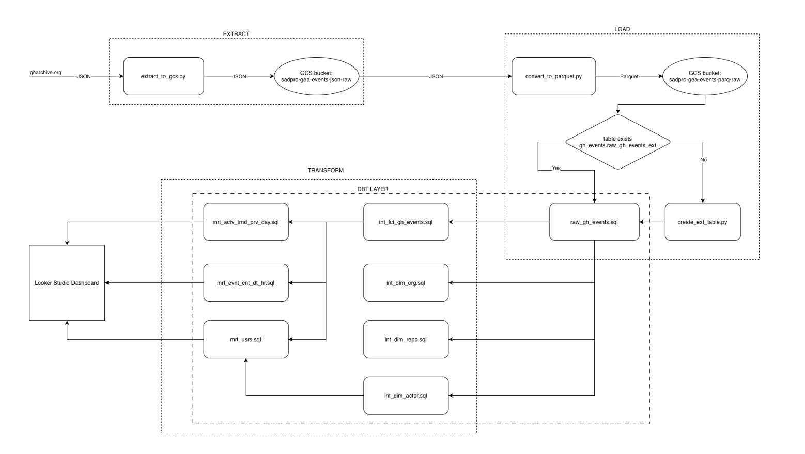

# GitHub Events data pipeline

## Context
Github genereates large volumes of semi-structured events data. But the data is not immediately ready for analysis. Raw JSON data is inefficeint to query, lacks structure, and makes it difficult to derive meaningful insights.
There is a need for a scalable and cost efficient pipeline that can ingest, transform and organise this data into a structured format that supports reliable analytics and reporting.

## Approach
To transform raw GitHub Events data into reliable, analytics-ready datasets, the pipeline is designed around three key principles:
### Separation of Concerns
The pipeline is divided into distinct layers — raw ingestion, optimized storage, and transformation. This ensures that each stage is independently manageable and reduces the risk of downstream failures due to upstream changes.
### Performance & Cost Optimization
Instead of querying raw JSON directly, the data is converted into a columnar format (Parquet) and later partitioned in BigQuery. This minimizes data scanned during queries and reduces storage and compute costs.
### Schema Stability & Scalability
Given that GitHub Events data can evolve over time, schema handling is enforced during ingestion to prevent pipeline breakage. The system is designed to scale with increasing data volume while maintaining consistency.
### ELT over ETL
Transformations are performed within BigQuery using dbt, leveraging the warehouse’s processing power rather than moving data across systems. This simplifies the architecture and improves scalability.
### Data Quality & Reliability
Basic data quality checks, such as duplicate detection and incremental load validation, are incorporated to ensure consistency and correctness of the transformed data.

## Architecture
The pipeline follows a layered architecture, starting from raw data ingestion in GCS, followed by optimized storage in Parquet format, loading into BigQuery, and transformation using dbt for analytics. Orchestration is handled using Apache Airflow running in Docker containers, enabling scheduling, dependency management, and backfilling of workflows.

Ingestion (Python) -> Storage (GCS - Parquet) -> Data Warehouse (BigQuery - External Tables) -> Transformation (dbt - staging, fact, dimension, marts) -> BI Layer (Looker Studio).

### Ingestion layer
Handles extraction of raw GitHub Events data and stores it in GCS
### Storage layer
Raw JSON data is converted into Parquet format and stored in GCS using Hive-style partitioning (e.g., year=YYYY/month=MM/day=DD). This enables efficient partition pruning when querying via BigQuery external tables.
### Serving layer (BigQuery)
External tables provide flexible access to raw data, while partitioned native tables optimize query performance
### Transformation layer (dbt)
Builds a dimensional model (fact and dimension tables) and enforces data quality checks
### Visualisation layer
Looker studio dashboard enables reporting and insights.

<b>Architecture Diagram:</b>

## Dashboard
- [View Dashboard](https://lookerstudio.google.com/reporting/15561452-8a42-4624-a8de-7f4dda32ae3b)

## Data Flow
### Ingestion
Raw GitHub Events data is downloaded as JSON files and stored in a Google Cloud Storage (GCS) bucket, serving as the initial landing layer.

## Storage & Optimisation
The JSON data is converted into Parquet format and stored in a separate GCS bucket for improved storage efficiency and query performance.
During conversion, a schema is explicitly defined to ensure consistency even if the source data evolves over time.
The Parquet data is organized using Hive-style partitioning (e.g., year=YYYY/month=MM/day=DD), enabling efficient partition pruning and reducing query costs.
To control storage costs, raw JSON files are automatically deleted after 30 days.

## Serving Layer (BigQuery)
A BigQuery external table is created over the Parquet files in GCS, providing a flexible staging layer.
From this, a native BigQuery table is created as an exact copy and partitioned by date. This improves query performance and reduces costs by limiting the amount of data scanned.

## Transformation (dbt)
Using dbt, the data from the native BigQuery table is transformed into a dimensional model consisting of fact and dimension tables (star schema).
Data quality is enforced through:
- Tests to prevent duplicate records
- Checks to ensure new data is correctly loaded (incremental validation)

## Analytics & Visualisation
The final fact and dimension tables are used to build dashboards in Looker Studio for reporting and insights.

## Data Model
### Overview
The transformed data is modelled using a dimensional (star schema) approach in dbt, enabling efficient querying and simplified analytics

#### Fact table - int_fct_gh_events
- Central table containing GitHub events
- Stores high-volume, time-based data
- Includes the following fields
  - surrogate_id,
  - id,
  - type,
  - actor_id,
  - repo_id,
  - org_id,
  - public,
  - created_at,
  - created_date

#### Dim table - int_dim_repo
- Dimension table containing the information of the GitHub Repos
- Includes the following fields
  - surrogate_id
  - id
  - name
  - url
    
#### Dim table - int_dim_org
- Dimension table containing the information of the GitHub Organisations
- Includes the following fields
  - surrogate_id
  - id
  - login
  - url

#### Dim table - int_dim_actor
- Dimension table containing the information of the actors in GitHub
- Includes the following fields
  - surrogate_id
  - id
  - login
  - url

### Why star schema?
- Reduces query complexity
- Improves performance for analytical workloads
- Works well with BI tools like looker studio

### dbt features used
- Incremental models --> process only new data
- Tests --> Ensure data quality (e.g., no duplicates, not null)
- Modular modesl --> easier maintenance and scalability
- Surrogate keys are used to uniquely identify dimension records.

## Tech Stack
- Programming: Python
- Cloud Platform: Google Cloud Platform
- Storage: Google Cloud Storage (GCS - Parquet)
- Data Warehouse: BigQuery
- Transformation: dbt
- Orchestration: Apache Airflow (Dockerised)
- Containerisation: Docker
- Data Modelling: Star schema (Fact & Dimension Tables)

## key features
- Designed and implemented end-to-end <b>ELT data pipeline</b> for processing large-scale GitHub events data
- Optimised data storage and query performance using <b>Parquet (columnar format).</b>
- Implemented Hive-style partitioning in GCS to enable efficient querying and reduce data scan costs.
- Leveraged BigQUery external tables for cost-efficient querying without data duplication.
- Build modular data transformations using <b>dbt</b>, including staging, fact, and dimension layers.
- Implemented dimensional data modelling (star schema) to support scalable analytics.
- Orchestrated workflows using <b>Apache Airflow</b> with support of scheduling, dependency management, and backfilling
- Applied <b>partitioning strategies</b> to reduce query cost and improve performance.
- Integrated a data retention mechanism into Airflow workflows, automatically deleting raw JSON files older than 30 days to control storage costs and maintain data hygiene.

## How to Run
1. <b>Prerequisites</b>
- Google cloud account
- gcloud setup on local
  

2. <b>Authentication</b>
- Run the following command to authenticate gcloud CLI.

        `gcloud auth application-default login`

3. <b>Setting up the infrastructure</b>
  a. <b>Creating a VM</b>
  - Create a VM on GCP from the console. We need the VM to run airflow.
  - The following configuration is used during development and the pipeline should run well in the configuration. However you are welcome to use the configuration you please.
    - Machine type: E2
    - Location: asia-south1-c (use the one closest to you)
    - API and identity management
      - Cloud API access scopes: Allow full access to all Cloud APIs (need this for the programs running on your VM to access cloud run)
  - During the creation of the VM give it a network tag.

  b. <b>Creating firewall rules</b>
  - A firewall rule needs to be created to access airflow webserver running on the VM from your local machine
  - To created a firewall rule, on GCP console, go to VPC networks --> firewall.
  - Click on create a firewall rule
  - Select the following
    - Direction of traffic: Ingress
    - Protocols and ports: Specified protocols and ports
      - Select <b>TCP</b> and in the ports text box enter <b>8080</b>. This is the port on which airflow webserver opens up.
    - Targets: add your VM's network tag. This is apply the firewall rule tou your VM.

  c. <b>Copy the airflow scripts to VM</b>
  - Run the following command from the directory that hosts the airflow directory to copy the scripts necessary to run airflow on the VM
    - `gcloud compute scp --recurse ./airflow ${INSTANCE_NAME}:~/ --zone=${ZONE_NAME}`
   
  d. <b>Create cloud run jobs</b>
  - We will be running our scripts on cloud run.
  - To create a cloud run job, follow the steps below.
    - `gcloud builds submit --config cloudbuild.yaml .`
    - Run the command above from the directory in which cloudbuild.yaml is present, before running this update the cloudbuld.yaml file with the name of the cloudrun job and the path to the Dockerfile you want to deploy in cloud run.

  e. <b>Starting the pipeline</b>
  - Once the VM and the cloudrun jobs are created, run the following commands to install docker on your VM
    - `gcloud compute ssh <your-vm-name>`
    - `sudo apt update`
    - `sudo apt upgrade -y`
    - `sudo apt install docker.io -y`
    - `sudo systemctl start docker`
    - `sudo systemctl enable docker`
   
  - Once docker is up and running, run the following command to start airflow.
    - `docker compose up`

  - To check if the containers are running, run the following
    - `docker compose ps`
    - There should be three containers - postgres, airflow-scheduler, airflow-webserver up and running.
   
  - Once the containers start in the browser on your local machine search for the following to access the webserver
    - http://EXTERNAL_IP:8080
  - login and you can see your pipeline running.

<b>NOTE: THE SCHEDULE IS DISABLE BY DEFAULT i.e., THE PIPELINE WILL NOT RUN ON SCHEDULE. THIS IS DONE TO PREVENT RUNAWAY COSTS. YOU CAN ENABLE IT BY CHANGING THE VARIABLE "schedule" AND UNCOMMENTING "schedule_interval" AND DEFINING YOUR OWN CRON EXPRESSION(THE PIPELINE IS BUILD TO RUN ONCE AN HOUR).</b> 

## Challenges Faced & Learnings
1. <b>High BigQuery costs due to full table scans</b>
- Initially, the pipeline scanned large valumes of data(~300GB per run), leading to excessive costs.
- This was caused by missing partitioning in the storage layer.
- <b>Resolution</b>: Resolved by implementing <b>Hive-style partitioning in GCS</b>, enabling partition pruning and significantly reducing query cost.
- <b>Learning</b>: Highlighted the importance of data partitioning strategies for cost optimisation in large-scale data processing.

2. <b>Airflow compatability issues on macOS</b>
- Faced issues running Airflow locally due to environment and version mismatches.
- <b>Resolution</b>: Implemented Airflow using docker containers ensuring consistent execution environment and simplifying setup.
- <b>Learning</b>: Reinforced the value of containerisation for environment consistency and reproducibility in data engineering workflows.

3. <b>Slow data processing due to disk I/O bottlenecks</b>
- Writing JSON data to disk before converting to Parquet introduced performance bottlenecks.
- <b>Resolution</b>: Optimised by processing data in-memory, reducing I/O overhead and improving pipeline performance.
- <b>Learning</b>: Demonstrated the impact of I/O operations on performance and the benefits of im-memory processing for high-throughput pipelines.

4. <b>Inefficient full-refresh transformations in dbt models</b>
- Initially implemented dimension tables using full-refresh materialisation, assuming they would remain small.
- As data volume increased, this led to unnecessary recomputation and higher query costs.
- <b>Resolution</b>: Optimised by converting dimension tables to incremental modesl, ensuring only new or updated data is processed improving efficiency and reducing cost.
- <b>Learning</b>: This highlighted the importance of choosing the right materialisation strategy based on data growth patterns.

          
